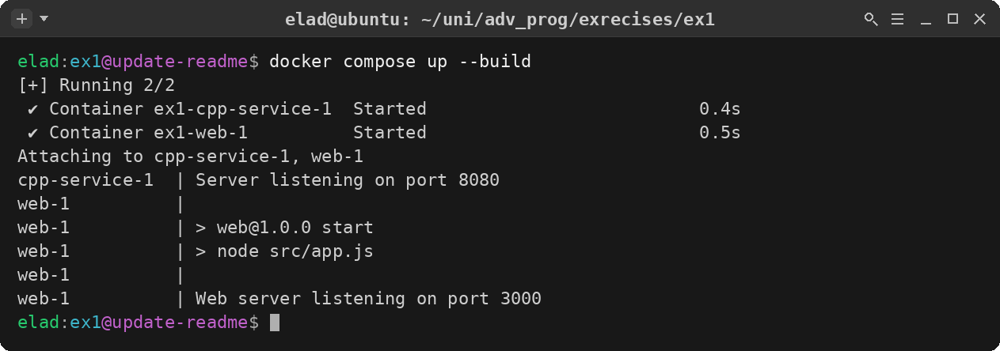
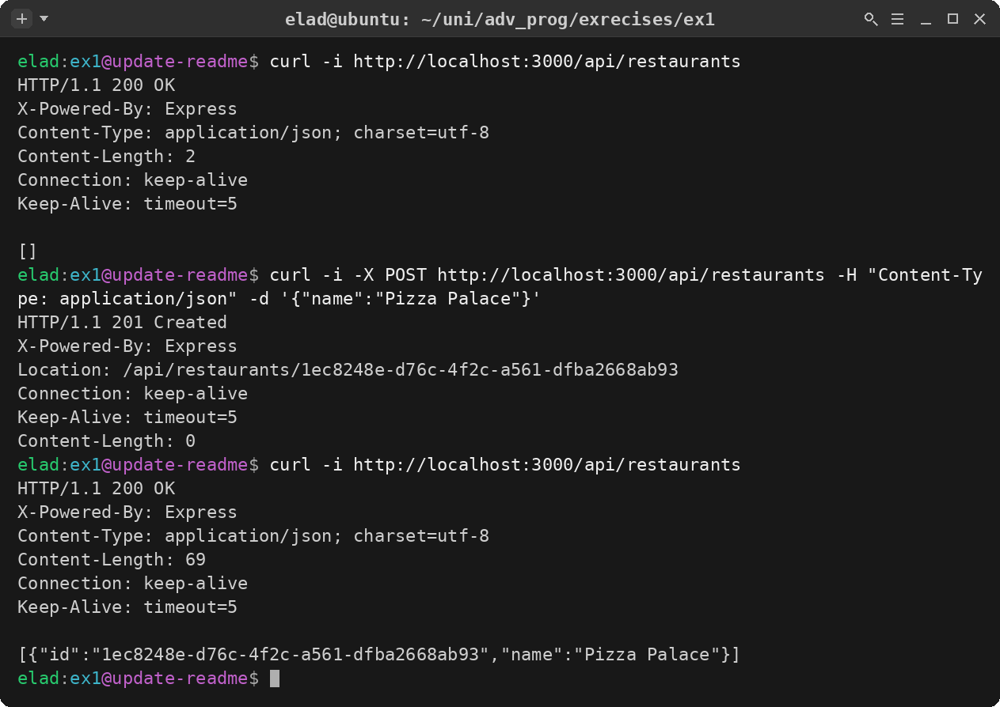
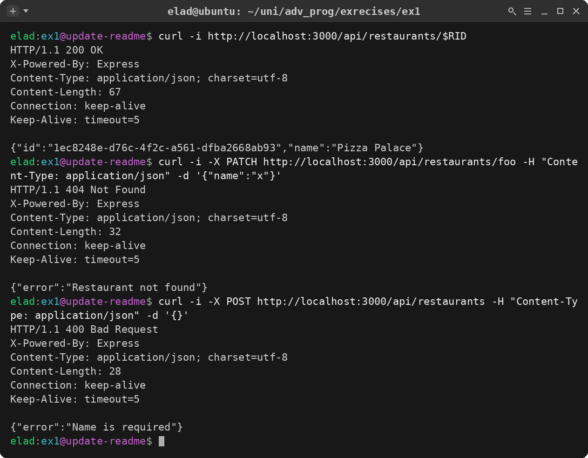
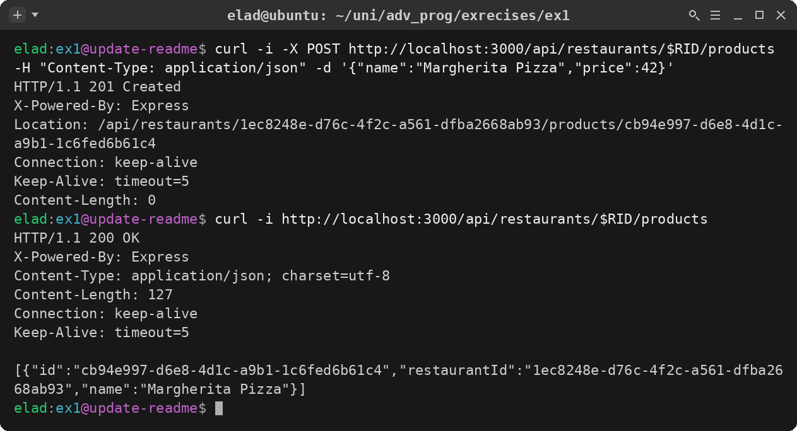
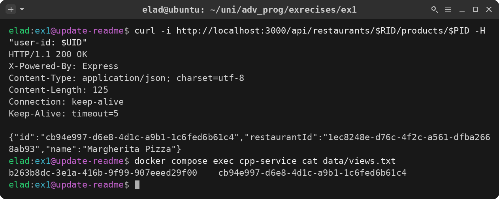
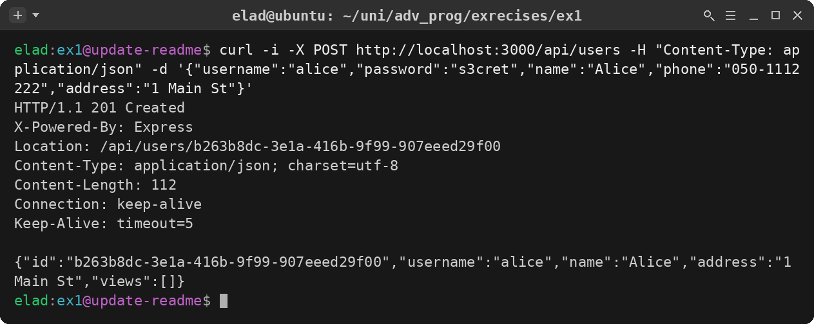
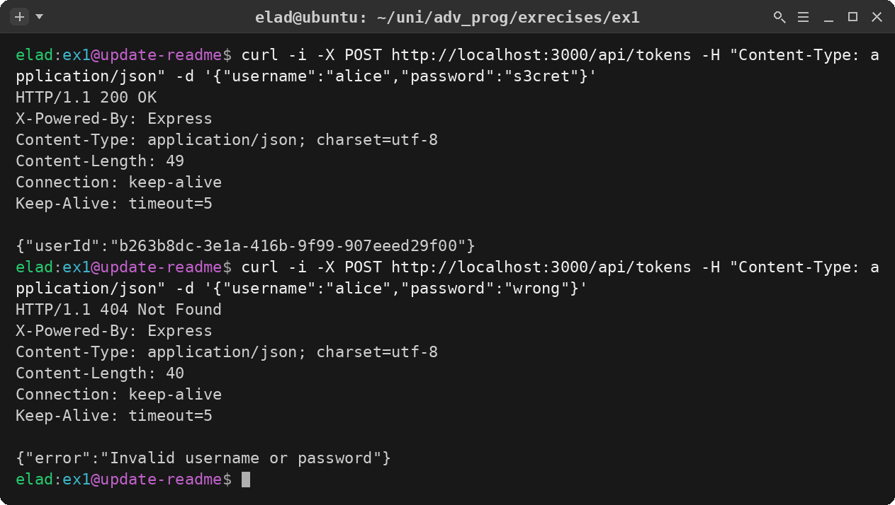
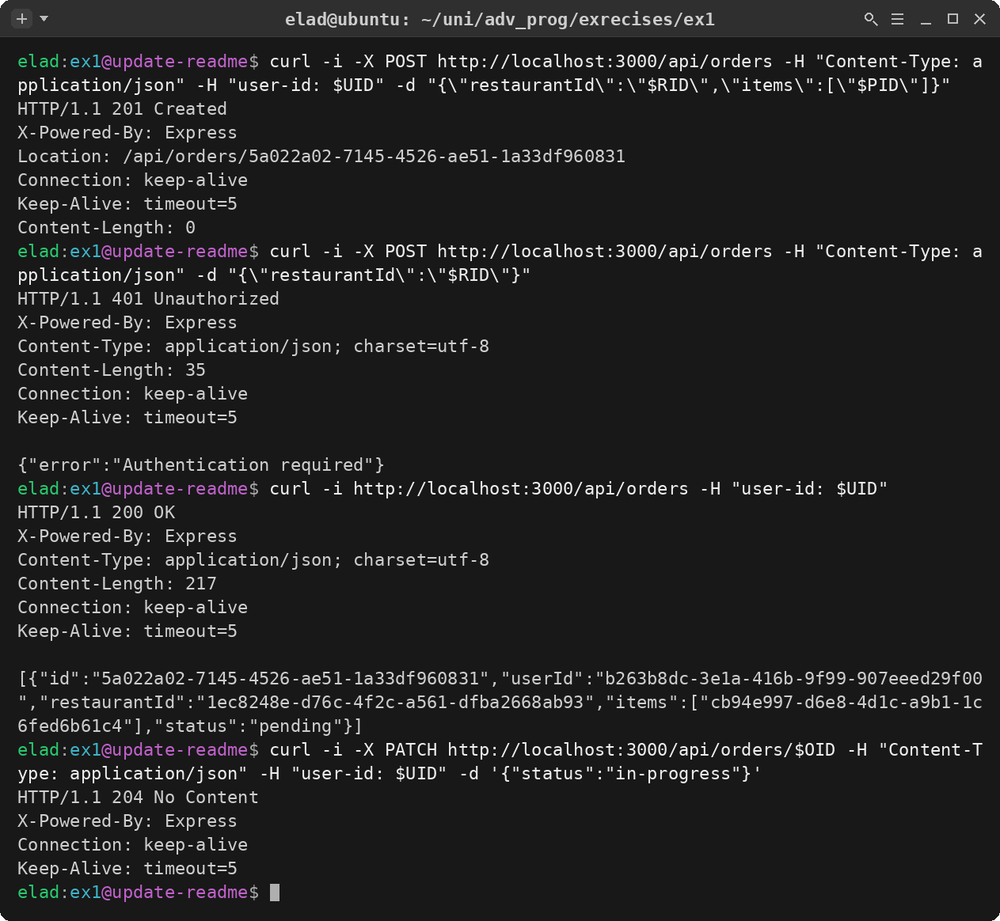
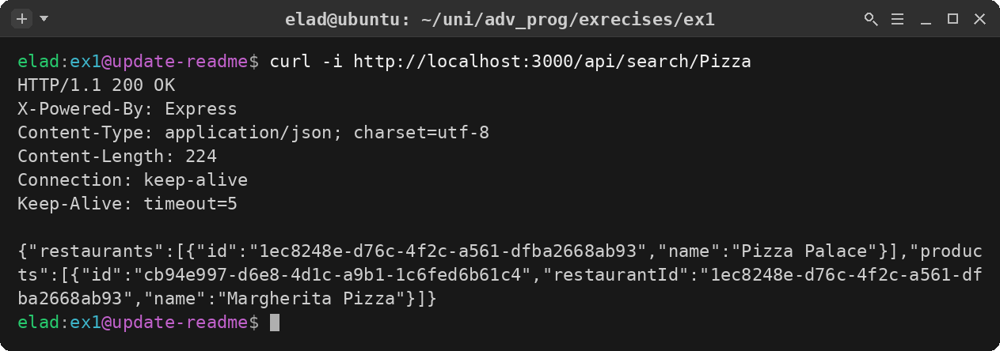

# AdvancedWolt — Food‑Delivery Web Service (Exercise 3)

A RESTful, JSON web server in the spirit of a food‑delivery app (Wolt‑style).
It is built with **Node.js + Express** in a clean **MVC** architecture and serves
the server‑side functionality behind three screens: **sign‑up**, **login**, and
the **main screen** (browse restaurants, view a menu, place orders, search).

The web server is the application core. For the *recommendation / "viewed
products"* functionality it talks, as a TCP **client**, to the **C++
recommendation server from Exercise 2** — exactly as the assignment requires.

> All `/api/*` endpoints speak **JSON** (never HTML). Data is kept **in
> memory**, so restarting the server clears everything.

---

## 📌 For the checker — branches & what belongs to which exercise

This repository carries the work of more than one exercise, kept strictly apart
so that earlier submissions stay frozen and graders can find each one:

| Branch | Exercise | Contents |
| :--- | :--- | :--- |
| **`ex2`** | **Exercise 2** (locked) | The C++ TCP client/server recommendation system. **Frozen** — not touched after submission, so it can still be graded and the grace‑days are not affected. |
| **`main`** | **Exercise 3** (this submission) | The Node + Express **MVC web server** (`web/`) **plus** the Exercise‑2 C++ server (`src/`), which the web server reuses over TCP. |

* **Exercise 2 is locked on the `ex2` branch** (`git checkout ex2`). Work on
  Exercise 3 continued on `main` so the two never mix.
* **The Exercise‑2 SOLID reflection answers are preserved in this README**, in
  the [Appendix — Exercise 2: SOLID reflection](#appendix--exercise-2-solid-reflection-answers)
  section at the bottom, *and* on the `ex2` branch. They are unchanged; this
  document only adds the Exercise‑3 material on top.

The C++ server still lives in `src/` on `main` because Exercise 3 **runs it as a
dependency** (the web server opens a socket to it). It is the same code that is
frozen on `ex2`.

---

## What the server does

The web server backs the screens of the app without implementing the screens
themselves:

* **Sign‑up screen** → `POST /api/users` (name, phone, address, username,
  password …).
* **Login screen** → `POST /api/tokens` (returns the user id on success).
* **Main screen** → browse restaurants, open a restaurant's menu, place and
  manage orders, and search restaurants/products.

Some actions are open to anyone (browsing restaurants); others conceptually
require a logged‑in user (placing an order). As the assignment specifies for
this stage, a logged‑in user is identified by sending their user id in the
**`user-id` HTTP header**.

---

## Architecture (MVC + the Exercise‑2 bridge)

```
HTTP / JSON client  (curl, Postman, or the app's screens)
        │
        ▼
┌──────────────────────────────────────────────────────────────────────┐
│  Express web server   ·   web/   ·   Exercise 3   ·   MVC             │
│                                                                      │
│   Routes ──▶ Middleware (auth) ──▶ Controllers ──▶ Models            │
│   /api/*       user-id header        HTTP logic       in‑memory      │
│   url → fn     401 if required       status codes     state + rules  │
└──────────────────────────────────────────────────────────────────────┘
        │   only for "viewed product" / recommendations
        ▼   raw TCP socket, newline‑delimited text protocol
┌──────────────────────────────────────────────────────────────────────┐
│  C++ recommendation server   ·   src/   ·   Exercise 2               │
│  speaks POST / PATCH / DELETE / GET over its own TCP protocol         │
└──────────────────────────────────────────────────────────────────────┘
```

**Request flow (`web/src`):**

* **Routes** (`routes/`) map a URL + HTTP verb to a controller function and wire
  in middleware. Adding an endpoint is a line in a router — nothing else changes.
* **Middleware** (`middleware/auth.js`) reads the `user-id` header. `requireAuth`
  returns **401** when it is missing; `attachUserId` makes it optional (used by
  *GET product*, where being logged in only adds a side effect).
* **Controllers** (`controllers/`) own the HTTP layer: validate input, pick the
  right status code, shape the JSON. They contain no storage details.
* **Models** (`models/`) are the single source of truth: in‑memory stores plus
  the domain rules (a product belongs to a restaurant, an order can only be
  edited while `pending`, passwords are stored only as a salted PBKDF2 hash,
  etc.).
* **Service** (`services/tcpClient.js`) is the only place that knows the
  Exercise‑2 server exists. It opens a socket and speaks that server's text
  protocol; its host/port come from `config/tcpConfig.js` (env‑driven).

**Where Exercise 2 is actually used.** Per the assignment, operations that need
the Exercise‑2 server call it instead of re‑implementing it. Concretely:
`GET /api/restaurants/:id/products/:pId` by a logged‑in user records that the
user **viewed** the product on the C++ server, and order creation mirrors the
ordered items as views. Recommendations are read back from the same server.

This keeps the design **loosely coupled** and faithful to **SOLID**: transport
(socket/HTTP), request handling (controllers), and state (models) are separable,
and the dependency on Exercise 2 sits behind one small service module.

---

## API reference

Base URL: `http://localhost:3000`. All bodies and responses are JSON.
"Auth" means the request must carry a `user-id: <id>` header.

### Users & authentication
| Method | Path | Auth | Success | Errors |
| :--- | :--- | :---: | :--- | :--- |
| `POST` | `/api/users` | – | `201 Created` + `Location` | `400` missing fields, `409` username taken |
| `GET`  | `/api/users/:id` | ✓ | `200 OK` (user details) | `404` not found |
| `POST` | `/api/tokens` | – | `200 OK` (`{ userId }`) | `400` missing fields, `404` bad credentials |

### Restaurants
| Method | Path | Auth | Success | Errors |
| :--- | :--- | :---: | :--- | :--- |
| `GET`    | `/api/restaurants` | – | `200 OK` (array) | – |
| `POST`   | `/api/restaurants` | – | `201 Created` + `Location` | `400` name required |
| `GET`    | `/api/restaurants/:id` | – | `200 OK` | `404` not found |
| `PATCH`  | `/api/restaurants/:id` | – | `200 OK` (updated) | `400` name required, `404` not found |
| `DELETE` | `/api/restaurants/:id` | – | `204 No Content` | `404` not found |

### Products (a restaurant's menu)
| Method | Path | Auth | Success | Errors |
| :--- | :--- | :---: | :--- | :--- |
| `GET`    | `/api/restaurants/:id/products` | – | `200 OK` (array) | `404` restaurant not found |
| `POST`   | `/api/restaurants/:id/products` | – | `201 Created` + `Location` | `400`/`404` |
| `GET`    | `/api/restaurants/:id/products/:pId` | optional | `200 OK` (and records a **view** if `user-id` is sent) | `404` |
| `PATCH`  | `/api/restaurants/:id/products/:pId` | – | `204 No Content` | `400`/`404` |
| `DELETE` | `/api/restaurants/:id/products/:pId` | – | `204 No Content` | `404` |

### Orders
| Method | Path | Auth | Success | Errors |
| :--- | :--- | :---: | :--- | :--- |
| `POST`   | `/api/orders` | ✓ | `201 Created` + `Location` | `400` invalid items, `404` restaurant |
| `GET`    | `/api/orders` | ✓ | `200 OK` (current user's orders) | – |
| `GET`    | `/api/orders/:id` | ✓ | `200 OK` | `404` not found |
| `PATCH`  | `/api/orders/:id` | ✓ | `204 No Content` | `400` invalid status/items, `404` |
| `DELETE` | `/api/orders/:id` | ✓ | `204 No Content` | `400` non‑pending, `404` |

### Search
| Method | Path | Auth | Success |
| :--- | :--- | :---: | :--- |
| `GET` | `/api/search/:query` | – | `200 OK` — `{ restaurants, products }` whose name/description contains `:query` |

**HTTP statuses used:** `200` ok · `201` created (+`Location`) · `204` no
content · `400` bad request · `401` authentication required · `404` not found ·
`409` conflict.

---

## Running the system

Two services run **separately** (as the assignment requires): the Express web
server and the Exercise‑2 C++ recommendation server. Docker Compose wires them
together on a private network.

### Option A — Docker Compose (recommended)

From the repository root:

```bash
docker compose up --build
```

This builds and starts both containers:

* **`cpp-service`** — the Exercise‑2 C++ server on port **8080**.
* **`web`** — the Express API on port **3000** (it reaches the C++ server at
  `cpp-service:8080` via the `CPP_SERVICE_HOST` / `CPP_SERVICE_PORT` env vars).

<p align="center">
  
</p>

The API is now at `http://localhost:3000`.

### Option B — the two containers by hand

```bash
# Exercise‑2 C++ server on 8080
docker build -t wolt-cpp .
docker run --rm -p 8080:8080 wolt-cpp 8080

# Express web server on 3000 (point it at the C++ server)
docker build -t wolt-web ./web
docker run --rm -p 3000:3000 \
  -e CPP_SERVICE_HOST=host.docker.internal -e CPP_SERVICE_PORT=8080 \
  wolt-web
```

### Option C — web server locally (Node)

```bash
# 1) start the C++ server (Docker as above, on 8080)
# 2) then:
cd web
npm install
CPP_SERVICE_HOST=127.0.0.1 CPP_SERVICE_PORT=8080 PORT=3000 npm start
```

Endpoints that never touch the recommender (restaurants, search, sign‑up …) work
even if the C++ server is down; only the view/recommendation path needs it.

---

## Walkthrough — the API in action

Every screenshot below is a **real terminal session** against the running stack
(`docker compose up`), captured with `curl -i` so the status line and headers
are visible. Ids shown in the output are the real UUIDs the server generated;
the commands reuse them through shell variables (`$RID`, `$PID`, `$UID`, `$OID`).

### Browse restaurants & a menu

The first block is the exact flow from the assignment's appendix: an empty list,
create a restaurant (`201` + `Location`), list again. Then: fetch one restaurant,
validation errors, add a product to the menu, and — the Exercise‑2 bridge — a
logged‑in user viewing a product, which is recorded on the C++ server.

<table>
  <tr>
    <td width="50%"></td>
    <td width="50%"></td>
  </tr>
  <tr>
    <td width="50%"></td>
    <td width="50%"></td>
  </tr>
</table>

> The bottom‑right shot proves the cross‑server integration: after the logged‑in
> `GET` of a product, the view appears in the C++ server's store
> (`data/views.txt`): `<userId> <productId>`.

### Sign up, log in, order & search

Register a user, log in (and a rejected login), create and manage an order as
the authenticated user (including a `401` when the `user-id` header is missing),
and a search that matches both a restaurant and a product.

<table>
  <tr>
    <td width="50%"></td>
    <td width="50%"></td>
  </tr>
  <tr>
    <td width="50%"></td>
    <td width="50%"></td>
  </tr>
</table>

---

## Tests

```bash
# Web (Node's built-in test runner; needs Node 18+)
cd web
npm install
npm test
```

```bash
# Exercise‑2 C++ unit tests, inside the image
docker build -t wolt-cpp .
docker run --rm --entrypoint ./build/tests/unit_tests wolt-cpp
```

---

## Security note

This is a teaching exercise: **do not** store or send real passwords, credit
cards, API keys, or any sensitive data. Passwords here are only ever kept as a
salted PBKDF2 hash and are never returned by the API.

---

# Appendix — Exercise 2: SOLID reflection (answers)

*The questions below belong to **Exercise 2**. The answers are preserved here
unchanged (and also live on the locked `ex2` branch) so the grader can find
them.*

### 1. Command names changed (add → POST, recommend → GET)
**Did it require touching closed code?**
Yes, in ex1 command names were hardcoded strings scattered across `AppInternals`
dispatch logic. There was no registry abstraction.

**Fix applied (ex2):** `CommandManager` holds a
`std::unordered_map<std::string, ICommand*>` registry. The dispatcher never
mentions a command name, it just looks up the key and forwards. Renaming a
command is a single string change at the registration site (e.g. `app.cpp`).
`CommandParser` lowercases the verb before lookup, so case sensitivity is
handled in one place too. The dispatcher is now genuinely closed to this change.

### 2. New commands added (PATCH, DELETE)
**Did it require touching closed code?**
No. Each new command is a self-contained class implementing `ICommand`:
```cpp
virtual models::Response execute(const models::ParsedCommand& cmd,
                                  IdbManager& db) = 0;
```
Registration is one line per command at startup. `CommandManager::dispatch`
and all existing commands are untouched. `HelpCommand` queries the
`CommandManager` registry dynamically, new commands appear in `help` output
automatically with zero changes to `HelpCommand` itself.
This is the Open/Closed Principle working as intended.

### 3. Command output format changed
**Did it require touching closed code?**
Partially. In ex1 commands returned raw strings and each command owned its
own formatting. There was no shared wire-format abstraction.

**Fix applied (ex2):** The new `models::Response` class with a `toWire()`
method centralizes all wire serialization. Commands return a semantic
`Response` object, not a raw string. Changing how a status serializes to wire bytes now means
touching only `Response::toWire()`, not every command that produces
that status. The `models::Status` enum + lookup table further ensure that
adding or renaming a status phrase is a single-line change.

### 4. I/O moved from console to TCP sockets
**Did it require touching closed code?**
No. This was the cleanest boundary in the design. Commands operate on
`ParsedCommand` structs and return `Response` objects, they have
zero knowledge of transport. The server loop in `main.cpp` owns the
socket, reads a line, calls `CommandParser` -> `CommandManager`, then
writes `response.toWire()` to the file descriptor. Switching from
`std::cin`/`std::cout` to a socket touched only `main.cpp`.

**Architecture overview:**
```
[socket fd]
      │
      ▼
┌─────────────────────────────────────────────────────┐
│  CommandParser                                       │
│  raw bytes → ParsedCommand                          │
└─────────────────────────────────────────────────────┘
      │
      ▼
┌─────────────────────────────────────────────────────┐
│  CommandManager                                      │
│  registry lookup → dispatch                         │
└─────────────────────────────────────────────────────┘
      │
      ▼
┌─────────────────────────────────────────────────────┐
│  ICommand::execute()                                 │
│  command logic only                                 │
└─────────────────────────────────────────────────────┘
      │
      ▼
┌─────────────────────────────────────────────────────┐
│  IdbManager                                          │
│  abstraction layer for the database                 │
└─────────────────────────────────────────────────────┘
```

Each layer is replaceable independently. In ex1, `App` + `AppInternals`
collapsed several of these layers together, which is why the socket
migration required no surgery on command or DB code, those layers
were already properly separated by ex2.
