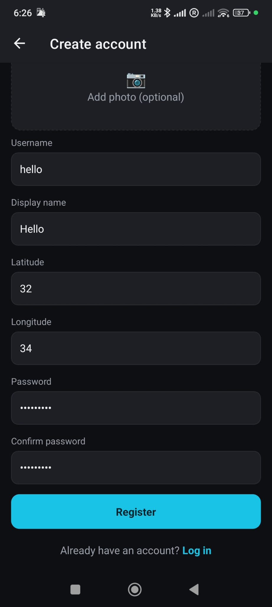
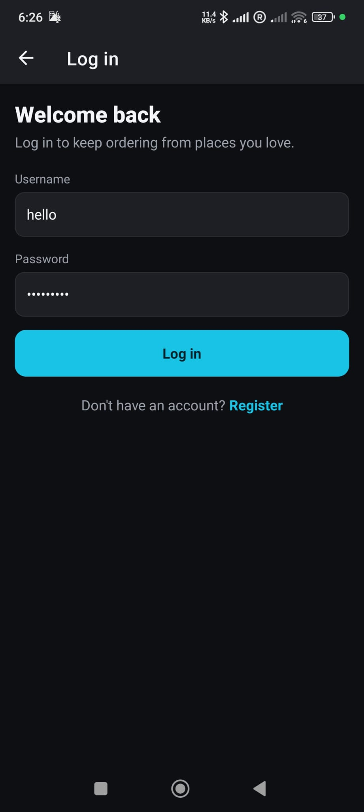
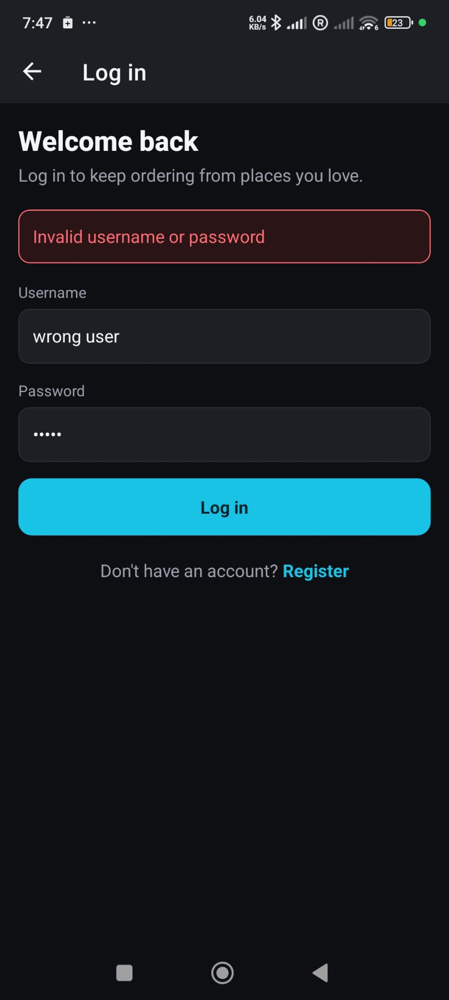

# Authentication Flows — Register & Login

This page covers account creation and sign-in on **both** clients, including the field
validation and the error messages a user sees when input is invalid. Make sure the stack is
running first — see **[Environment Setup](Environment-Setup.md)**.

> ⬅ Back to the [wiki home](Home.md).

---

## Validation rules (enforced on both clients)

The web and mobile clients share the same rules (`client/src/utils/validators.js` and
`mobile/src/utils/validators.js`), and the Express server validates again on its side. All
fields are **required**, plus:

| Field                | Rule                                                                 | Message on failure                                                            |
| -------------------- | ------------------------------------------------------------------- | ---------------------------------------------------------------------------- |
| Username             | required, **≥ 3 characters**                                        | `Username must be at least 3 characters`                                     |
| Password             | required, **≥ 8 chars** and contains **both letters and digits**    | `Password must be at least 8 characters` / `…contain at least one letter`/`…digit` |
| Confirm password     | must **match** the password                                         | `Passwords do not match`                                                      |
| Display name         | required                                                            | `Display name is required`                                                    |
| Location X / Y       | required, must be a **number**                                      | `X must be a number` / `Y must be a number`                                   |
| Profile image        | optional; choose from gallery/camera, shows a **preview**           | image errors surface inline                                                   |
| Role                 | **Customer** or **Restaurant owner** (owners get the Manage screen) | —                                                                             |

The form's submit button stays **disabled** until every field is valid, so it is not
possible to register or log in with bad input.

---

## Web client

### Register

1. Open **<http://localhost:3000>** and go to **Sign up**.
2. Fill username, password + confirm, display name, X/Y location, optionally pick a profile
   image (live preview), and choose a role.
3. Invalid fields show inline messages in real time; submit is disabled until all pass.
4. On success you are logged in and redirected to Home; the Navbar shows your name/avatar.

The registration screen, validation, and a duplicate-username error:

  
  
  

### Login & logout

- **Login:** enter your username and password to receive a JWT (managed in `AuthContext`).
  Wrong credentials show a clear error and do not sign you in.
- **Protected routes:** unauthenticated users can browse restaurants and menus, but opening
  the **Cart** or **Orders** pages redirects them to Login.
- **Logout:** clears the token and returns the user to the Login screen.

---

## Mobile client

The mobile register/login screens mirror the web rules (`mobile/src/utils/validators.js`),
with the same disabled-until-valid submit and inline error messages. The role picker offers
**Customer** and **Restaurant owner**, and the image picker uses the device gallery/camera
via `expo-image-picker` and shows a preview.

### Register (mobile)

1. From the Login screen, tap **Sign up**.
2. Fill the same fields; pick a role and (optionally) a profile image — the preview appears
   immediately.
3. Submit stays disabled until all fields validate; on success you land on the Home feed.

  

### Login & validation errors (mobile)

- **Login** with username + password; a wrong username/password shows a clear message.
- Invalid input (e.g. a too-short password) shows the inline validation message and blocks
  submission.
- **Logout** from the drawer returns the user to the Login screen.

  

  

---

Next: **[CRUD Flows](CRUD-Flows.md)** — creating, editing and deleting restaurants, dishes
and orders.
