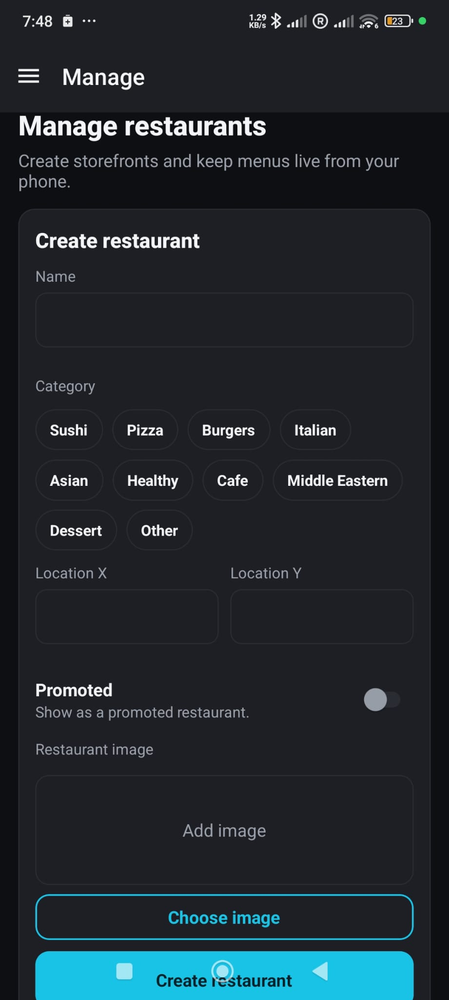
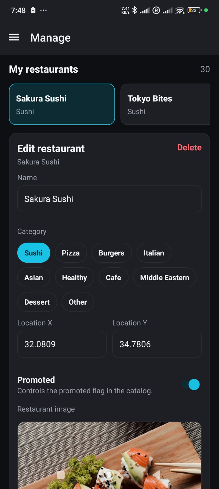
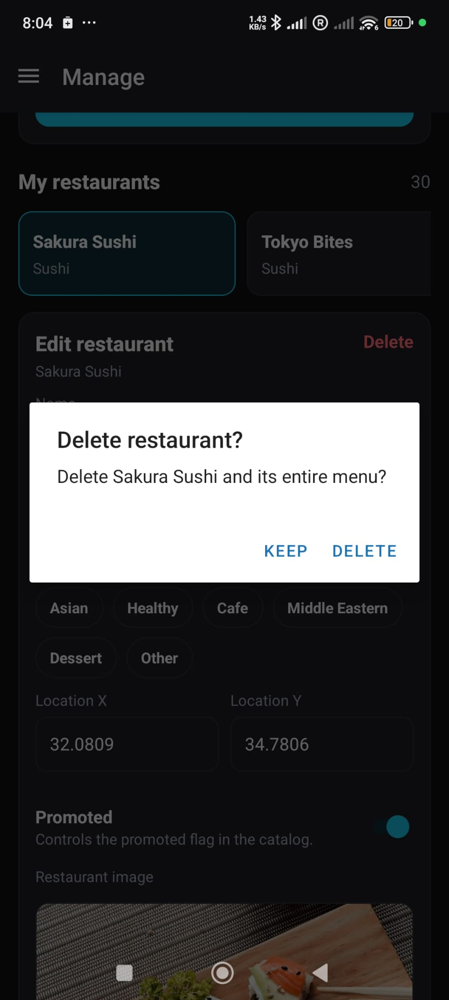
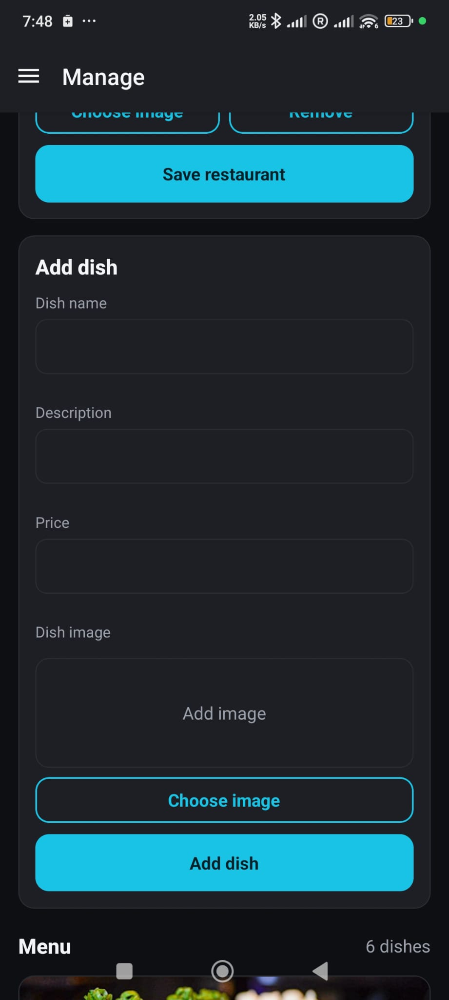
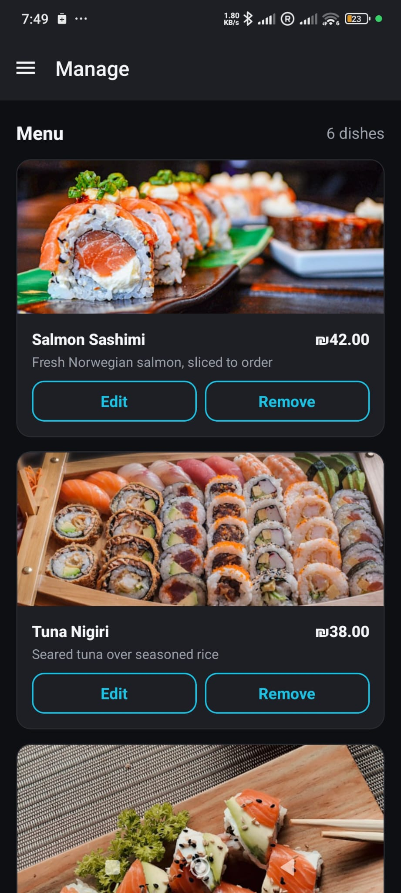
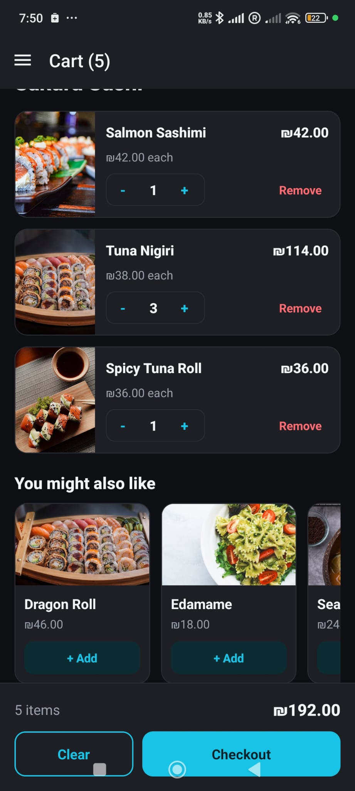
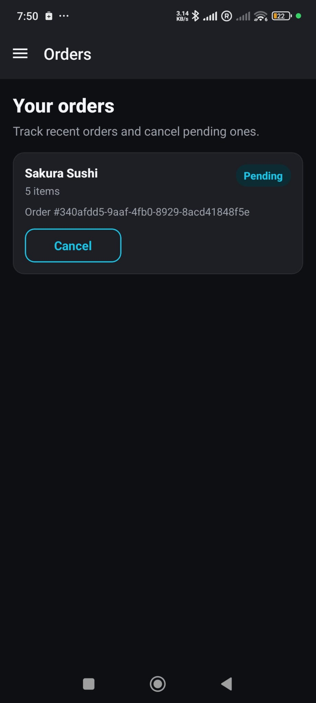
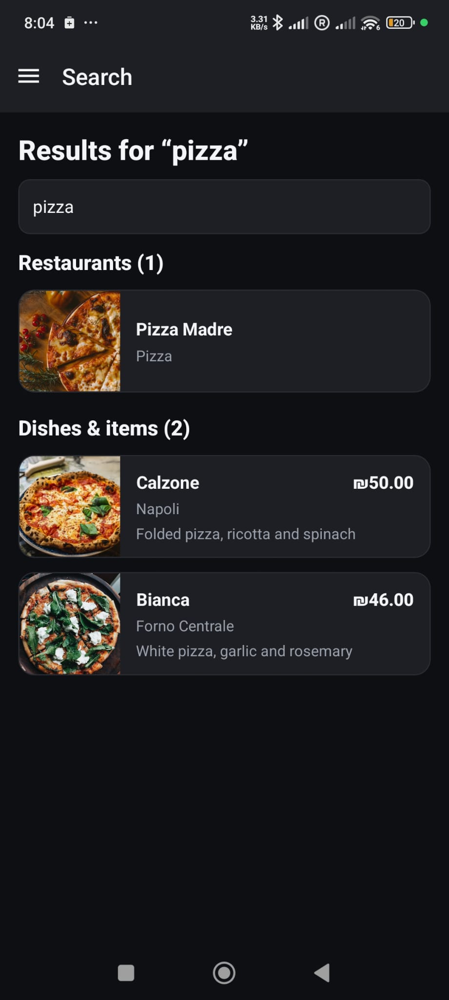

# CRUD Flows — Restaurants, Dishes & Orders

This page demonstrates **create / edit / delete** for restaurants, dishes (products) and
orders on **both** clients. Each flow maps to a real REST endpoint on the Express API. Make
sure the stack is up (**[Environment Setup](Environment-Setup.md)**) and you are logged in
(**[Authentication Flows](Authentication-Flows.md)**).

> ⬅ Back to the [wiki home](Home.md).

---

## Roles & endpoints at a glance

| Domain        | Create                              | Read                                  | Update                                | Delete                                              |
| ------------- | ----------------------------------- | ------------------------------------- | ------------------------------------- | --------------------------------------------------- |
| Restaurants   | `POST /api/restaurants` (owner)     | `GET /api/restaurants[/:id]`          | `PATCH /api/restaurants/:id` (owner)  | `DELETE /api/restaurants/:id` (owner, **cascades**) |
| Dishes        | `POST /api/restaurants/:id/products`| `GET /api/restaurants/:id/products`   | `PATCH …/products/:pId`               | `DELETE …/products/:pId`                             |
| Orders        | `POST /api/orders` (auth)           | `GET /api/orders[/:id]`               | `PATCH /api/orders/:id` (status)      | `DELETE /api/orders/:id`                             |

> **Restaurants and dishes** are managed by **Restaurant owner** accounts via the **Manage**
> screen. **Orders** are created by any logged-in user from the **Cart**. Deleting a
> restaurant cascades — its menu (and related orders) are removed on the server.

---

## Restaurants (create / edit / delete)

### Web — Manage screen

1. Log in as a **Restaurant owner** and open **Manage**.
2. **Create:** fill the new-restaurant form (name, description, location, image) → it appears
   in your list (`POST /api/restaurants`).
3. **Edit:** change a field and save (`PATCH /api/restaurants/:id`).
4. **Delete:** use the confirm dialog; the restaurant and its menu disappear
   (`DELETE /api/restaurants/:id`).

  

### Mobile — Manage screen

The same flow lives behind the **Manage** drawer item for owner accounts.

  

  

  

---

## Dishes / products (create / edit / delete)

Dishes are nested under a restaurant (`/api/restaurants/:id/products`).

### Web

From a restaurant in **Manage**: add a dish (name, price, description, image), edit its
fields, or delete it. The restaurant menu page reflects the change immediately.

The restaurant menu / dish view on web (also shows recommendations from the C++ server):

  
  

### Mobile

  

  

---

## Orders (create / view / update status / delete)

Any logged-in user can place an order from the **Cart**, then track it under **Orders**.

### Web

1. Add dishes to the **Cart**; quantities and totals update live.
2. **Place order** → creates a pending order (`POST /api/orders`).
3. Open **Orders → order detail** to see the itemized receipt; change the status
   (`PATCH /api/orders/:id`) or delete the order (`DELETE /api/orders/:id`).

  

### Mobile

  

  

---

## Search (bonus flow, both clients)

A global search queries restaurants and dishes together (`GET /api/search/:query`).
Both clients search as you type and group the matches into **Restaurants** and
**Dishes & items**.

### Web

  

### Mobile

  

---

That completes the main flows. Back to the **[wiki home](Home.md)**.
