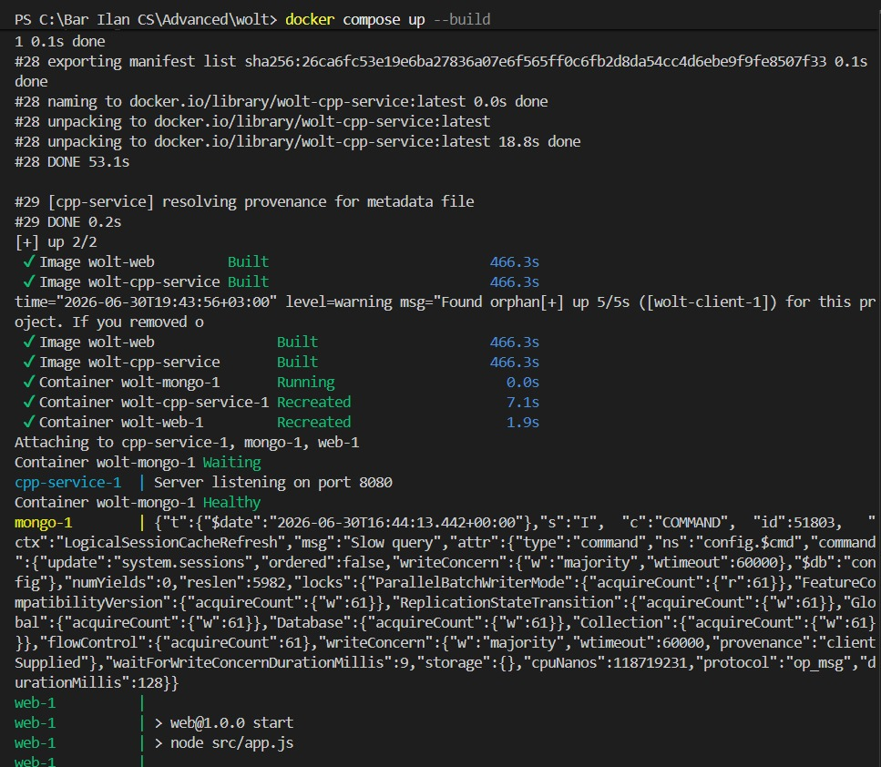
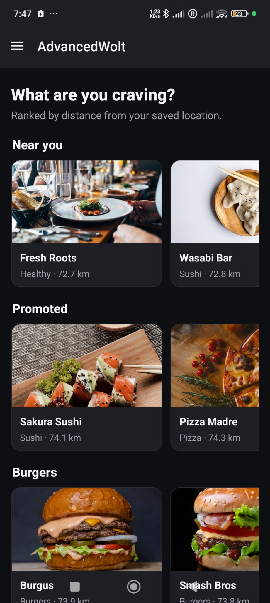

# Environment Setup — Raising the whole system

This page walks through bringing up **the entire stack** with `docker-compose` and running
**both** clients (web and mobile) against it. Follow the steps in order.

> ⬅ Back to the [wiki home](Home.md).

---

## 0. Prerequisites

- **Docker Desktop** (provides `docker compose`) — runs the C++ recommender, MongoDB, and
  the Express API + web client.
- **Node.js 20+** and **npm** — only needed to run the **mobile** client locally.
- **Mobile runtime**, one of:
  - **Android emulator** (Android Studio), or
  - a **physical phone** with the **Expo Go** app installed.

No secrets or `.env` files are required: the connection string and ports are provided by
`docker-compose.yml`, and the API seeds an empty database automatically on first boot.

---

## 1. Raise the backend stack (C++ + MongoDB + Express + web client)

From the **repository root**:

```bash
docker compose up --build
```

This builds and starts the three services defined in `docker-compose.yml`:

1. **`cpp-service`** — the EX2 C++ recommendation server on port `8080`.
2. **`mongo`** — a MongoDB 7 instance. It is **not** published to the host (avoids clashing
   with any local MongoDB) and its data lives in the named volume `mongo-data`, so it
   **survives restarts**. A healthcheck gates the `web` service so the API does not start
   until Mongo is actually accepting connections.
3. **`web`** — the Express API on port `3000`. On boot it connects to MongoDB through
   Mongoose, logs `Connected to MongoDB at …`, **seeds** the empty database with demo
   restaurants / menus / users / orders (idempotent — skipped if data already exists), and
   serves the built **React web client** from the same process.

Wait until the logs show the Mongo connection and seed completion.

<p align="center">
  
</p>

Once it is up:

- **Web client:** open **<http://localhost:3000>**
- **REST API:** available under **<http://localhost:3000/api>**

Here is the seeded Home screen in the web client:

<p align="center">
  
</p>

---

## 2. Run the mobile client (React Native + Expo)

The mobile app is **not** containerized — run it with Expo after the backend is up. The
phone/emulator cannot reach the server over `localhost`, so the API base URL is configurable
via `EXPO_PUBLIC_API_URL` (see `mobile/src/config/api.js`).

```bash
cd mobile
npm install
npm run android      # or: npx expo start  → press a, or scan the QR in Expo Go
```

### Choosing the right base URL

`localhost` on a device points at the device itself, so the API URL depends on how you run
the app:

| Running the app on…          | `EXPO_PUBLIC_API_URL`                                       |
| ---------------------------- | ---------------------------------------------------------- |
| **Android emulator**         | *leave unset* → default `http://10.0.2.2:3000`             |
| **iOS simulator** (macOS)    | `http://localhost:3000`                                    |
| **Physical phone (Expo Go)** | `http://<YOUR-PC-LAN-IP>:3000` (e.g. `http://192.168.1.20:3000`) |

On the **Android emulator** a grader sets nothing — just `npm run android`.

For a **physical phone**, find your PC's LAN IP (`ipconfig` on Windows, `ipconfig getifaddr
en0` on macOS, `hostname -I` on Linux) and pass it when starting Expo:

```powershell
# Windows PowerShell
$env:EXPO_PUBLIC_API_URL = "http://192.168.1.20:3000"; npx expo start
```
```bash
# macOS / Linux / Git Bash
EXPO_PUBLIC_API_URL=http://192.168.1.20:3000 npx expo start
```

The value is baked in at startup, so **restart Expo** after changing it. If the phone can't
connect, check that it shares the **same Wi‑Fi** and that **port 3000** is allowed through the
firewall.

> See **`mobile/README.md`** for the `.env` file alternative, the WSL port-forward snippet,
> and a full troubleshooting table.

The mobile Home feed should list the same seeded restaurants as the web client:

<p align="center">
  
</p>

> Do **not** commit `node_modules` — dependencies are installed locally only.

---

## 3. Verify the system is live

A quick end-to-end check that the documented commands actually work:

1. `docker compose up --build` — wait for the API to log its MongoDB connection and seed.
2. Open **<http://localhost:3000>** (web) and confirm the Home feed shows seeded restaurants.
3. Launch the mobile app and confirm its Home feed shows the same restaurants.
4. Log in or register on either client, then open a protected screen (Cart / Orders /
   Manage) to confirm JWT-backed auth works against the MongoDB-backed data.

Continue to **[Authentication Flows](Authentication-Flows.md)** and
**[CRUD Flows](CRUD-Flows.md)** for the full walkthroughs.

---

## 4. Teardown

```bash
docker compose down
```

The `mongo-data` volume persists, so a later `docker compose up` keeps your data. To wipe
the database as well:

```bash
docker compose down -v
```
